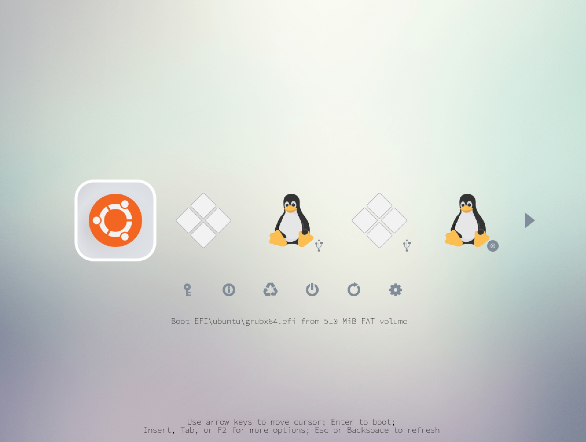

# refind-theme-regular

A simplistic clean and minimal theme for rEFInd, with presets for normal and HD monitors, like the macbook. It's a beautifull theme for super-users.

When starting your computer it presents you all your operating systems, and an icon detailing from where you will boot. Along with some tools including: a command prompt, reboot and shutdown options, and more.

### Usage

Read the setup instructions for [linux](docs/install-linux.md), [macOs](docs/install-macos.md), or [windows](docs/install-windows).

### Contribute

If you want to modify the theme and make a contribution read [build](docs/build.md) documentation to help you get started.

**More information**

The official [rEFInd website][refind-website].

### Attribution

- Roderick W. Smith, developer of rEFInd
- [munlik][refind-theme-original], the initial creator.
- [bobafetthotmail][refind-theme-regular], continuing the work of munlik
- [bertgoens][bertgoens-github] updating the visuals, extending the documentation

The background is [Minimalist Wallpaper][wallpaper] by
[LeonardoAIanB][wallpaper-author].

[refind-website]: https://www.rodsbooks.com/refind/
[refind-theme-original]: https://github.com/munlik/refind-theme-regular
[refind-theme-regular]: https://github.com/bobafetthotmail/refind-theme-regular
[wallpaper]: https://leonardoalanb.deviantart.com/art/Minimalist-wallpaper-295519786
[wallpaper-author]: https://leonardoalanb.deviantart.com/
[bertgoens-github]: https://github.com/BertGoens